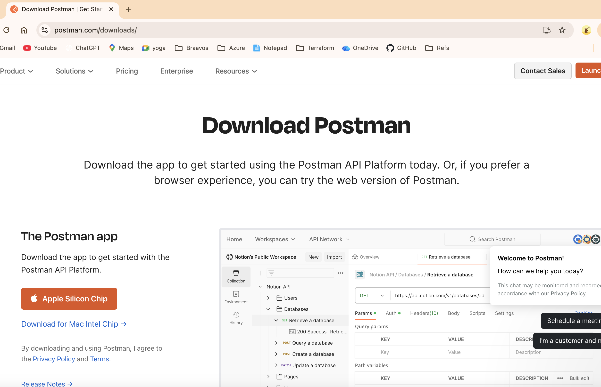
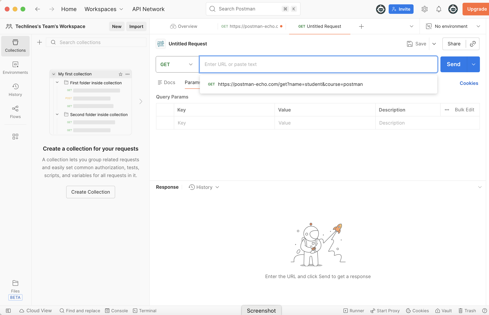

## Installing Postman

Postman is a popular API client used to test and explore REST APIs.

### Steps
1. Visit https://www.postman.com/downloads/  
  
2. Download the installer for your operating system
3. Install and launch Postman
4. Sign in or continue without an account
5. Choose Continue as Free user and Give Teams Name.

Postman is now ready to use.
  
