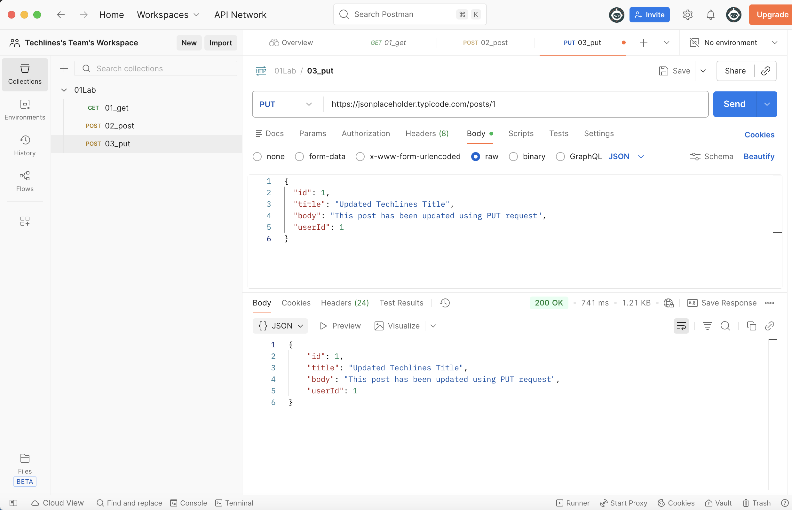

## Lab 3: PUT Request (Update Data)

### Objective
Update existing data using PUT request in Postman.

### Request Details
- Method: PUT
- URL: https://jsonplaceholder.typicode.com/posts/1
- Headers:
  - Content-Type: application/json

### Body (JSON)
{
  "id": 1,
  "title": "Updated Techlines Title",
  "body": "This post has been updated using PUT request",
  "userId": 1
}

### Expected Result
- Status Code: 200 OK
- Updated JSON returned in response
  