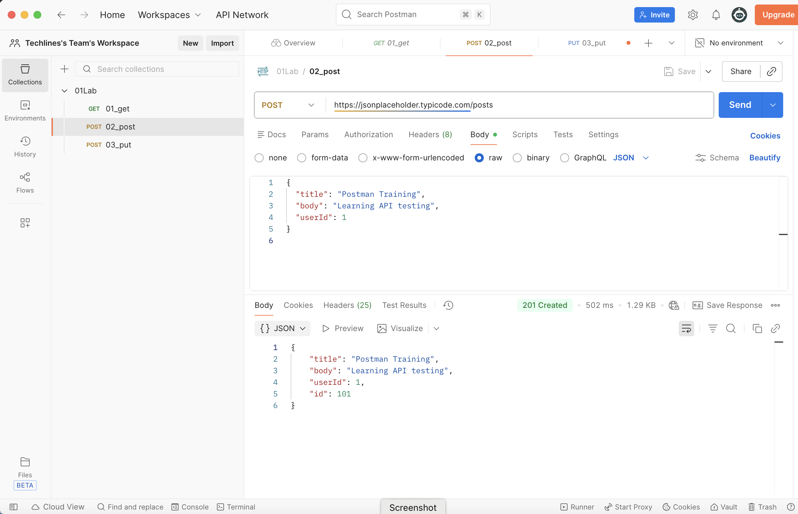

## Lab 2: POST Request (Create Data) using Postman

### Objective
Learn how to create new data using a **POST** request and understand how request body works in APIs.

---

### API Details
- **Method**: POST  
- **URL**: https://jsonplaceholder.typicode.com/posts  
- **Tool**: Postman

> Note: This is a public **mock API** used only for learning. Data is not stored permanently.

---

### Step-by-Step Instructions

#### Step 1: Create a New Request
- Open **Postman**
- Click **New → HTTP Request**

---

#### Step 2: Select HTTP Method
- Change the method to **POST**

---

#### Step 3: Enter Request URL
https://jsonplaceholder.typicode.com/posts  


---

#### Step 4: Add Request Headers
Go to the **Headers** tab and add:

| Key | Value |
|---|---|
| Content-Type | application/json |

---

#### Step 5: Add Request Body
1. Go to the **Body** tab  
2. Select **raw**  
3. Choose **JSON**  
4. Paste the below content:

```json
{
  "title": "Postman API Lab",
  "body": "This post is created using POST request in Postman",
  "userId": 1
}
```
Step 6: Send the Request

Click Send

Expected Response  
Status Code  
201 Created  
---
**Response Body Sample**
```
{
  "id": 101,
  "title": "Postman API Lab",
  "body": "This post is created using POST request in Postman",
  "userId": 1
}
```
**Key Concepts**

    POST → Used to create new data
    Request Body → Data sent to the server
    201 Created → Resource created successfully
    JSON → Common data format used in REST APIs

  